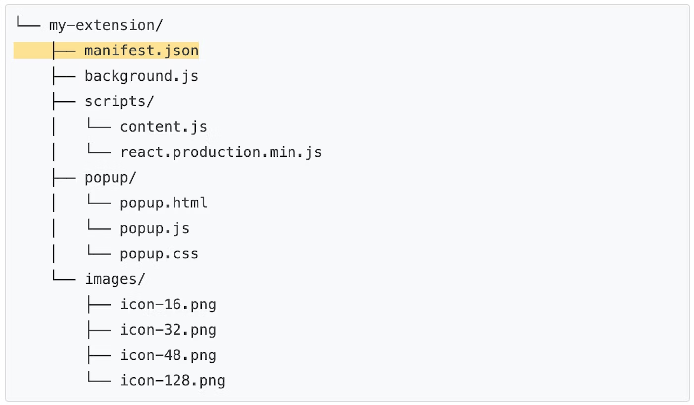

# Hello Chrome Extension

> - https://developer.chrome.com/docs/extensions/mv3/getstarted/development-basics/

---

- [Hello Chrome Extension](#hello-chrome-extension)
  - [Structuring an extension project](#structuring-an-extension-project)

---

## Structuring an extension project

